# Telco Project — i2i Systems Staj Görevi

Bu repo, **i2i Systems** staj başvurusu kapsamında verilen telekom veritabanı görevinin çözümünü içerir. Oracle XE 21c üzerinde şema tasarımı, CSV veri import'u, 6 kategori altında 11 SQL sorgusu ve bonus olarak `docker-compose` tabanlı tek komutla kurulabilen otomatik seed'li ortam sağlanmıştır.

---

## İçindekiler

- [Proje Yapısı](#proje-yapısı)
- [Hızlı Başlangıç (Docker Compose)](#hızlı-başlangıç-docker-compose)
- [DBeaver Bağlantısı](#dbeaver-bağlantısı)
- [Şema Tasarımı](#şema-tasarımı)
- [Veri Yükleme](#veri-yükleme)
- [Sorgular ve Sonuçlar](#sorgular-ve-sonuçlar)
- [Doğrulama](#doğrulama)

---

## Proje Yapısı

```
telco-project-main/
├── docker-compose.yml             # Oracle XE container + otomatik seed
├── init/
│   ├── 01_create_tables.sql       # Şema (container start'ında otomatik çalışır)
│   └── 02_load_data.sql           # CSV import (external tables ile)
├── TABLE_CREATION_SCRIPTS.sql     # Şema (manuel çalıştırma için)
├── SOLUTIONS.sql                  # 6 kategori, 11 sorgu (Türkçe yorumlu)
├── CUSTOMERS.csv                  # 10.000 müşteri
├── MONTHLY_STATS.csv              # 9.950 aylık istatistik
├── TARIFFS.csv                    # 4 tarife
├── screenshots/                   # Tüm ekran görüntüleri
└── README.md
```

---

## Hızlı Başlangıç (Docker Compose)

**Ön Koşul:** Docker Desktop kurulu ve çalışıyor olmalı.

```bash
# Repo klasöründe:
docker compose up -d

# Container'ın hazır (healthy) olmasını bekleyin (~2-3 dakika, ilk açılışta CSV yüklemesi yapılır)
docker compose ps
```

İlk açılışta `init/` klasöründeki scriptler otomatik olarak çalışır:
1. `01_create_tables.sql` → tablo + index oluşturur
2. `02_load_data.sql` → CSV'lerden veri import eder

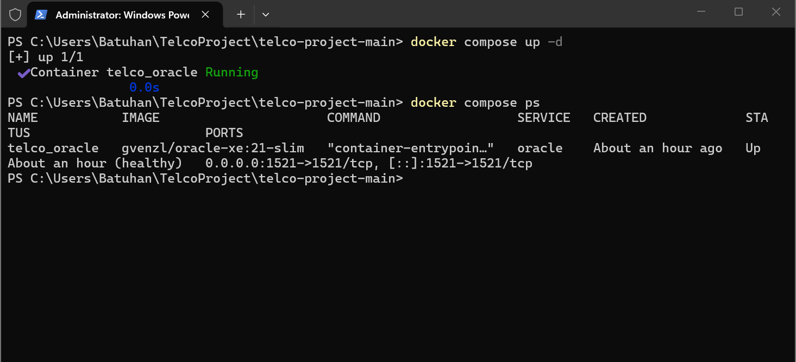

**Bağlantı Bilgileri:**

| Alan      | Değer       |
|-----------|-------------|
| Host      | `localhost` |
| Port      | `1521`      |
| Service   | `XEPDB1`    |
| Kullanıcı | `telco`     |
| Şifre     | `telco123`  |

---

## DBeaver Bağlantısı

1. DBeaver → **Database → New Database Connection → Oracle**
2. Yukarıdaki bağlantı bilgilerini girin (**Database** alanı: `XEPDB1`, tip: **Service Name**)
3. **Test Connection → Finish**

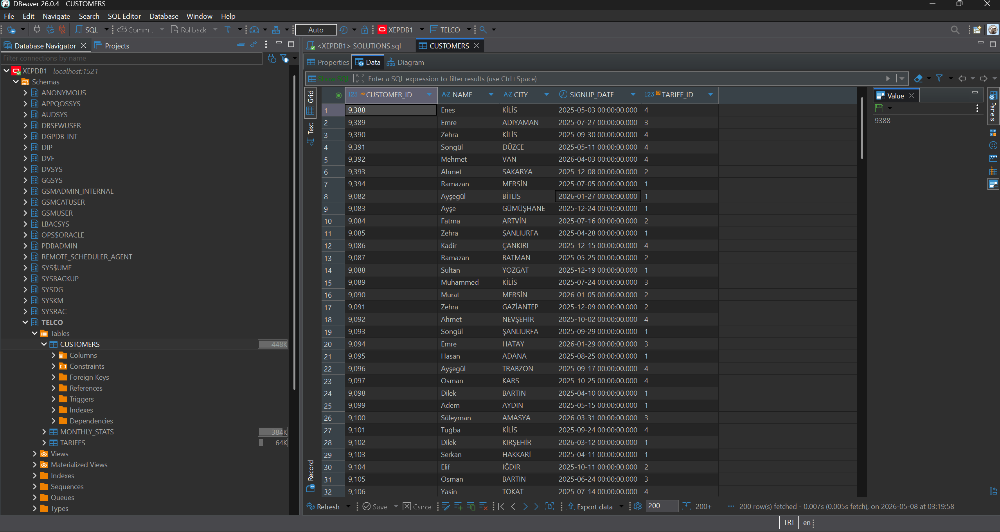

---

## Şema Tasarımı

Üç tablodan oluşan ilişkisel model:

- **TARIFFS** — 4 tarife (Genç Dinamik, Kurumsal SMS, Çalışan GB, Kobiye Destek)
- **CUSTOMERS** — Müşteri kayıtları (TARIFFS'a FK)
- **MONTHLY_STATS** — Aylık kullanım/ödeme (CUSTOMERS'a FK)

**Önemli Tasarım Kararları:**

- `VARCHAR2(N CHAR)` semantik kullanılarak Türkçe karakterler doğru şekilde işlenir (AL32UTF8).
- `MONTHLY_FEE` ve `DATA_USAGE` için `NUMBER(p, 2)` ondalık hassasiyet (örn. `18420.61 MB`, fiyat değişiklikleri için esneklik).
- `PAYMENT_STATUS` için CHECK kısıtı: yalnızca `PAID`, `LATE`, `UNPAID`.
- `DATA_LIMIT = 0` veya `MINUTE_LIMIT = 0` → **sınırsız** anlamına gelir (örn. Kurumsal SMS tarifesi). Sorgular bu özel durumu dikkate alır.
- JOIN ve filtre performansı için 5 adet B-tree index: `TARIFF_ID`, `SIGNUP_DATE`, `CITY`, `MONTHLY_STATS.CUSTOMER_ID`, `PAYMENT_STATUS`.

Tüm DDL → [`TABLE_CREATION_SCRIPTS.sql`](TABLE_CREATION_SCRIPTS.sql)

---

## Veri Yükleme

CSV import'u **Oracle External Tables** (`ORACLE_LOADER`) yöntemi ile yapılır — SQL\*Loader ayrı dosyası gerektirmez. CSV'ler container'a `/opt/oracle/data/` altına mount edilir, `csv_data_dir` Directory nesnesi üzerinden okunur.

- Tarihler `DD/MM/YYYY` formatında parse edilir (`TO_DATE`).
- `DATA_USAGE` ondalıklı string → `TO_NUMBER` ile dönüştürülür.
- Yükleme sonrası geçici external tablolar drop edilir, ardından `DBMS_STATS.GATHER_TABLE_STATS` ile istatistikler yenilenir.

**Yükleme sonrası satır sayıları:**

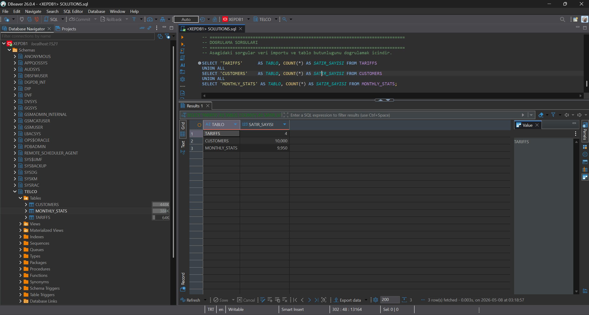

| Tablo          | Satır  |
|----------------|--------|
| TARIFFS        | 4      |
| CUSTOMERS      | 10.000 |
| MONTHLY_STATS  | 9.950  |

> **Not:** 10.000 müşteriye karşılık 9.950 aylık kayıt vardır → 50 müşterinin kaydı eksiktir (Görev 4'ün konusu).

---

## Sorgular ve Sonuçlar

Tüm sorgular ve detaylı Türkçe açıklamaları → [`SOLUTIONS.sql`](SOLUTIONS.sql)

### Kategori 1 — Tarife Bazlı Müşteri Sorguları

**1.1** `Kobiye Destek` tarifesindeki müşteriler (2.483 kayıt)

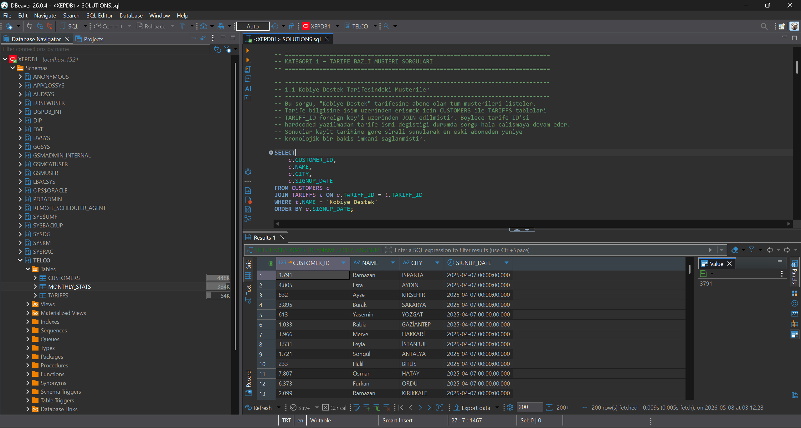

**1.2** Bu tarifeye en son kayıt olan müşteri

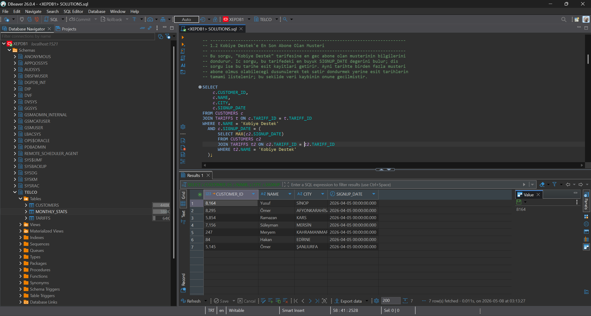

### Kategori 2 — Tarife Dağılımı

**2.1** Tarife başına müşteri sayısı ve yüzdelik dağılım (window function ile)

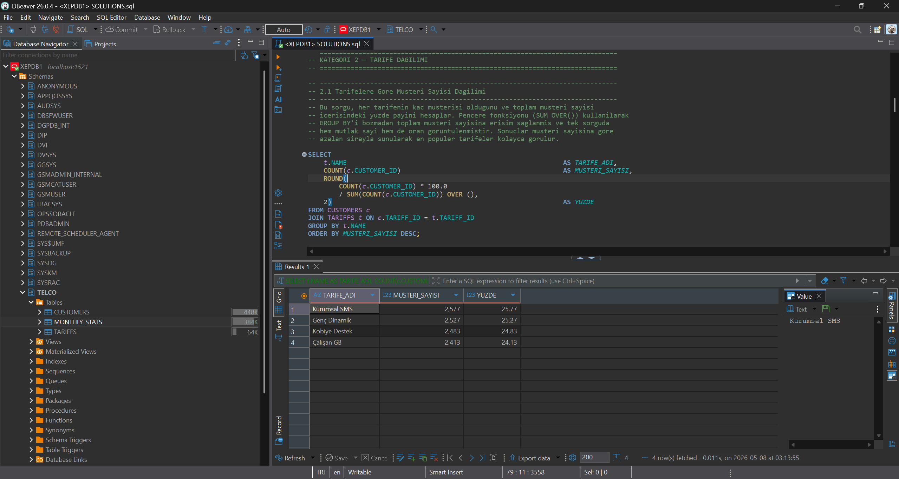

### Kategori 3 — En Erken Kayıt Analizi

**3.1** En erken kayıt tarihindeki müşteriler — `2025-04-07` tarihinde 35 müşteri.
*(İpucu doğrultusunda, en düşük ID değil; en küçük `SIGNUP_DATE` baz alındı.)*

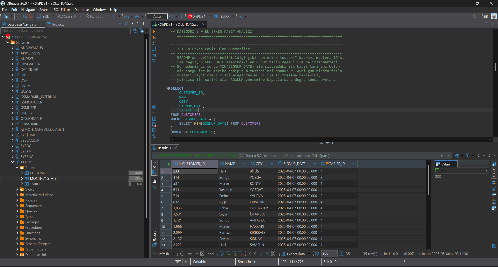

**3.2** Bu müşterilerin şehir dağılımı

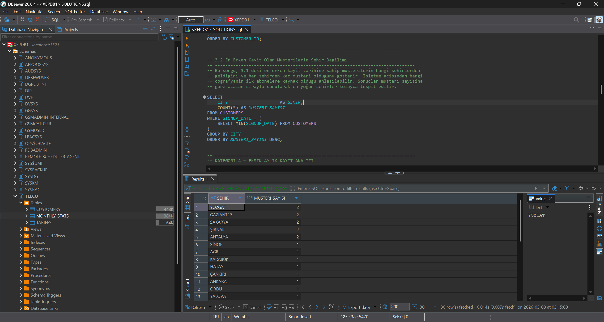

### Kategori 4 — Eksik Aylık Kayıt

**4.1** `MONTHLY_STATS` kaydı olmayan müşteriler (50 kayıt)

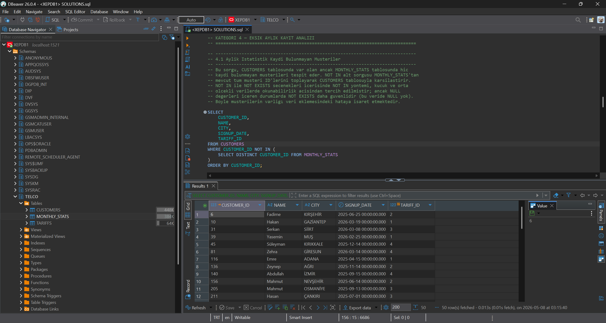

**4.2** Eksik müşterilerin şehir dağılımı

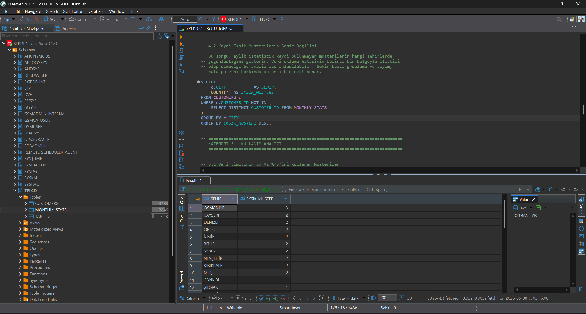

### Kategori 5 — Kullanım Analizi

**5.1** Data limitinin %75'ini veya fazlasını kullanan müşteriler
*(Sınırsız tarife `DATA_LIMIT = 0` filtre ile dışarıda bırakılır.)*

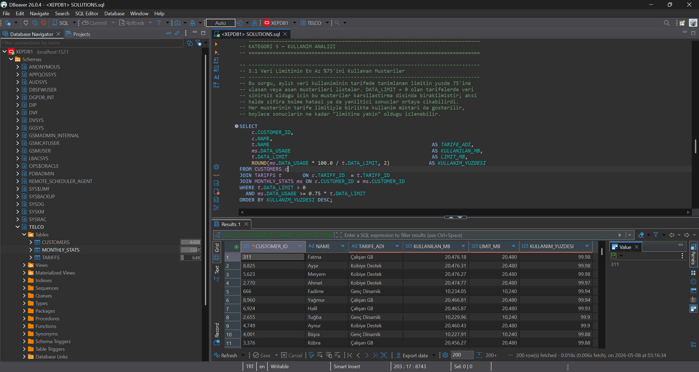

**5.2** Tüm paket limitlerini (data + dakika + SMS) tüketen müşteriler
*(0 = sınırsız mantığı her üç limit için ayrı ayrı uygulanır; tamamen sınırsız tarife hariç tutulur.)*

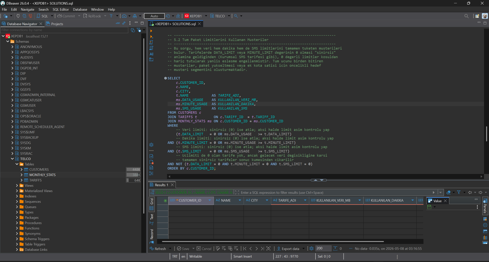

### Kategori 6 — Ödeme Analizi

**6.1** Ödenmemiş (`UNPAID`) faturası olan müşteriler

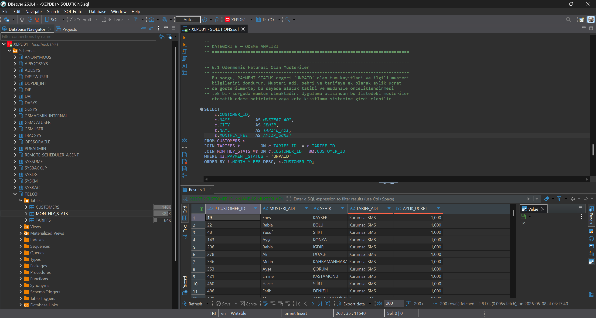

**6.2** Tarifeye göre ödeme durumu dağılımı

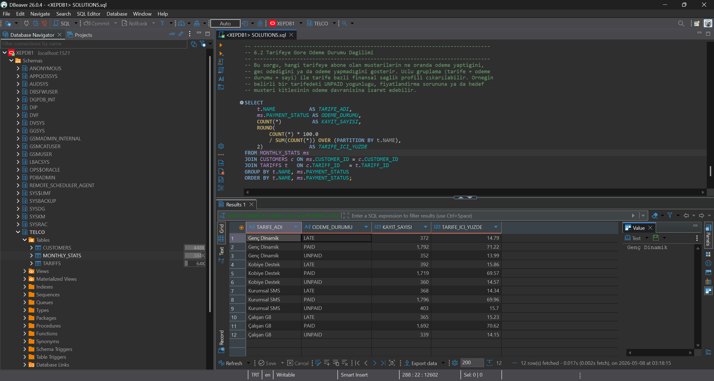

---

## Doğrulama

| Kontrol                                  | Beklenen | Sonuç |
|------------------------------------------|----------|-------|
| TARIFFS satır sayısı                     | 4        | ✅ 4    |
| CUSTOMERS satır sayısı                   | 10.000   | ✅ 10.000 |
| MONTHLY_STATS satır sayısı               | 9.950    | ✅ 9.950 |
| Eksik müşteri sayısı (4.1)               | 50       | ✅ 50  |
| Kobiye Destek müşterileri (1.1)          | ~2.500   | ✅ 2.483 |
| 5.1 sorgusunda Tariff 2 hariç tutulması  | 0 satır  | ✅ Filtreli |

---

## Bonus Tamamlananlar

- ✅ `docker-compose.yml` ile tek komutta Oracle XE ortamı
- ✅ `init/` scriptleri ile **otomatik seeding** (tablo oluşturma + CSV import)
- ✅ Adım adım reprodüksiyon dokümantasyonu + ekran görüntüleri (bu README)
- ✅ Named volume (`oracle_data`) ile veri kalıcılığı
- ✅ Healthcheck tanımı

---

**Geliştirici:** Batuhan Oğuz
**Veritabanı:** Oracle XE 21c
**Araçlar:** Docker, DBeaver
